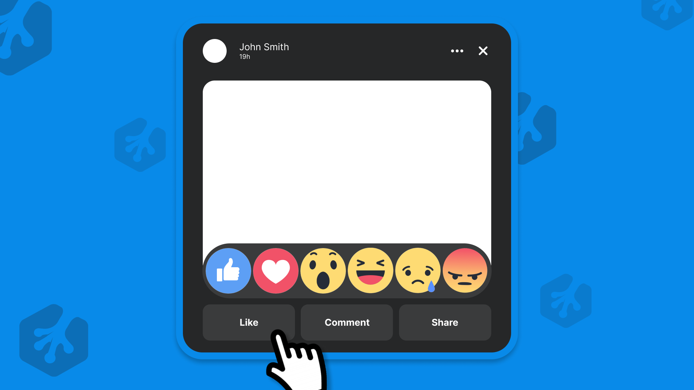

# Lets Build Facebook Reactions with Just CSS!



We'll use the following CSS Variables to build out our UI:

```
    --fb-post-border: #088AE9;

    --fb-post-bg: #262728;
    --fb-post-color: #FFFFFF;

    --fb-post: #FFFFFF;

    --fb-post-btn-bg: #3A3B3C;
    --fb-post-btn-color: #FFFFFF;
    --fb-post-btn-bg-hover: #464849;

    --fb-reactions-bg: #3A3B3C;
  ```

